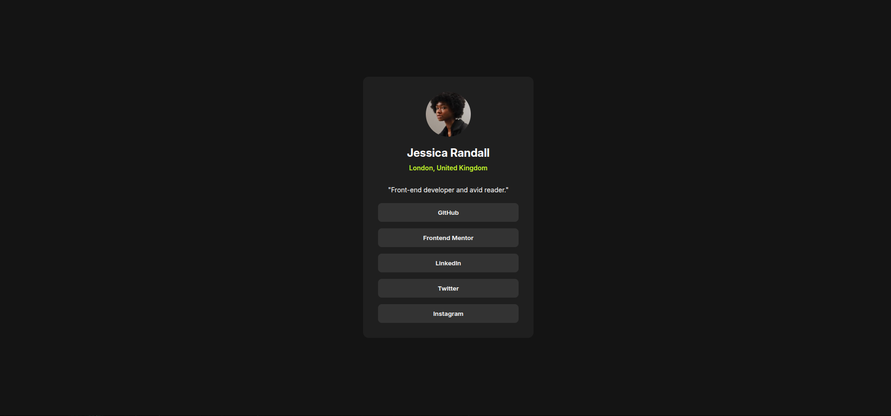

# Frontend Mentor - Social links profile solution

This is a solution to the [Social links profile challenge on Frontend Mentor](https://www.frontendmentor.io/challenges/social-links-profile-UG32l9m6dQ). Frontend Mentor challenges help you improve your coding skills by building realistic projects. 

## Table of contents

- [Overview](#overview)
  - [The challenge](#the-challenge)
  - [Screenshot](#screenshot)
  - [Links](#links)
  - [Built with](#built-with)
  - [Continued development](#continued-development)
- [Author](#author)
- [Acknowledgments](#acknowledgments)

## Overview
This design featured a social media link profile.

### The challenge

Users should be able to:

- See hover and focus states for all interactive elements on the page

### Screenshot

### Links

- Solution URL: (https://github.com/IGNORAMUS1/social-media-link.git)
- Live Site URL: (https://ignoramus1.github.io/social-media-link/)

### Built with

- Semantic HTML5 markup
- CSS custom properties
- Flexbox

### Continued development

I want to consistently improve my frontend development skills.

## Author

- Website - [Folorunsho Opeyemi](https://www.your-site.com)
- Frontend Mentor - [@IGNORAMUS1](https://www.frontendmentor.io/profile/IGNORAMUS1)

## Acknowledgments

I'm using this medium to say thanks to Frontend Mentor team and the maker of this design for making this challenge available for free.
